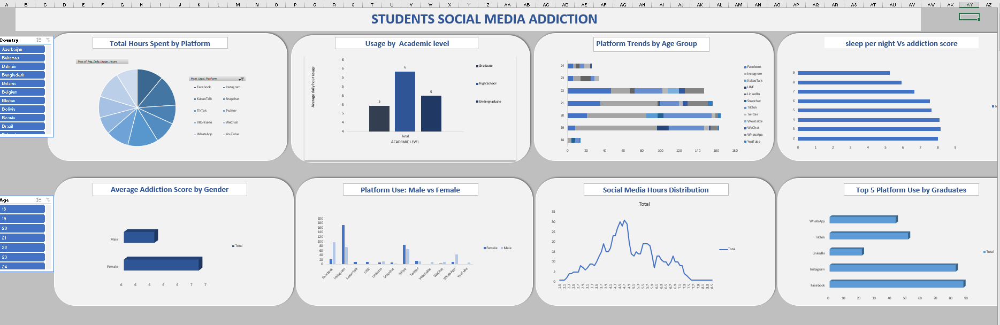

# Students’ Social Media Addiction Analysis (Excel)

## 📊 Project Overview
This project analyzes students’ social media usage patterns to understand behavioral trends and potential addiction indicators. The analysis focuses on how time spent on social platforms impacts productivity, sleep patterns, and daily habits.

## 🎯 Objective
- To identify usage patterns among students  
- To analyze the impact of social media on behavior and lifestyle  
- To derive insights that can help improve time management and productivity  

## 🛠 Tools & Techniques Used
- Microsoft Excel  
- Pivot Tables  
- Charts & Graphs  
- Data Cleaning & Formatting  

## 📂 Dataset Description
The dataset includes:
- Daily social media usage (hours)  
- Age group of students  
- Preferred platforms  
- Impact on sleep and productivity  
- Frequency of usage  

## 📈 Key Insights
- High social media usage is linked with reduced productivity  
- Students spending more than 4–5 hours daily show signs of behavioral impact  
- Night-time usage significantly affects sleep patterns  
- Certain platforms show higher engagement among specific age groups  

## 📊 Dashboard Features
- Interactive charts showing usage trends  
- Platform-wise comparison  
- Time spent vs productivity analysis  
- Behavioral impact visualization  

## 📸 Dashboard Preview

## 📁 Files Included
- Social_Media_Analysis.xlsx  
- Dataset.xlsx  

## 🚀 Conclusion
The analysis highlights how excessive social media usage affects student behavior and productivity. The dashboard provides clear insights that can help in making informed decisions regarding digital habits.

## 🔗 Project Link
GitHub Repository: https://github.com/Singhmahi09/social-media-addiction-analysis
